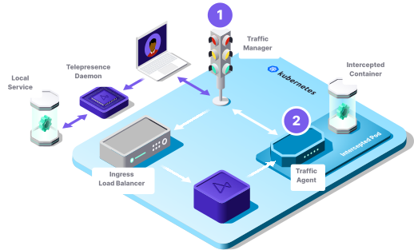
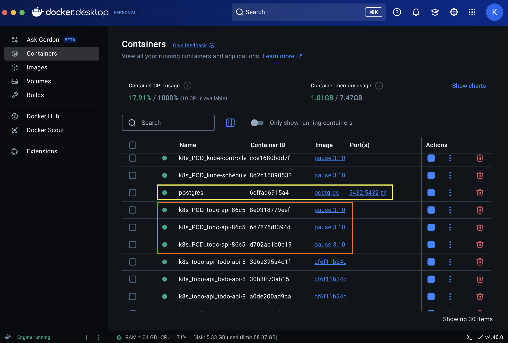
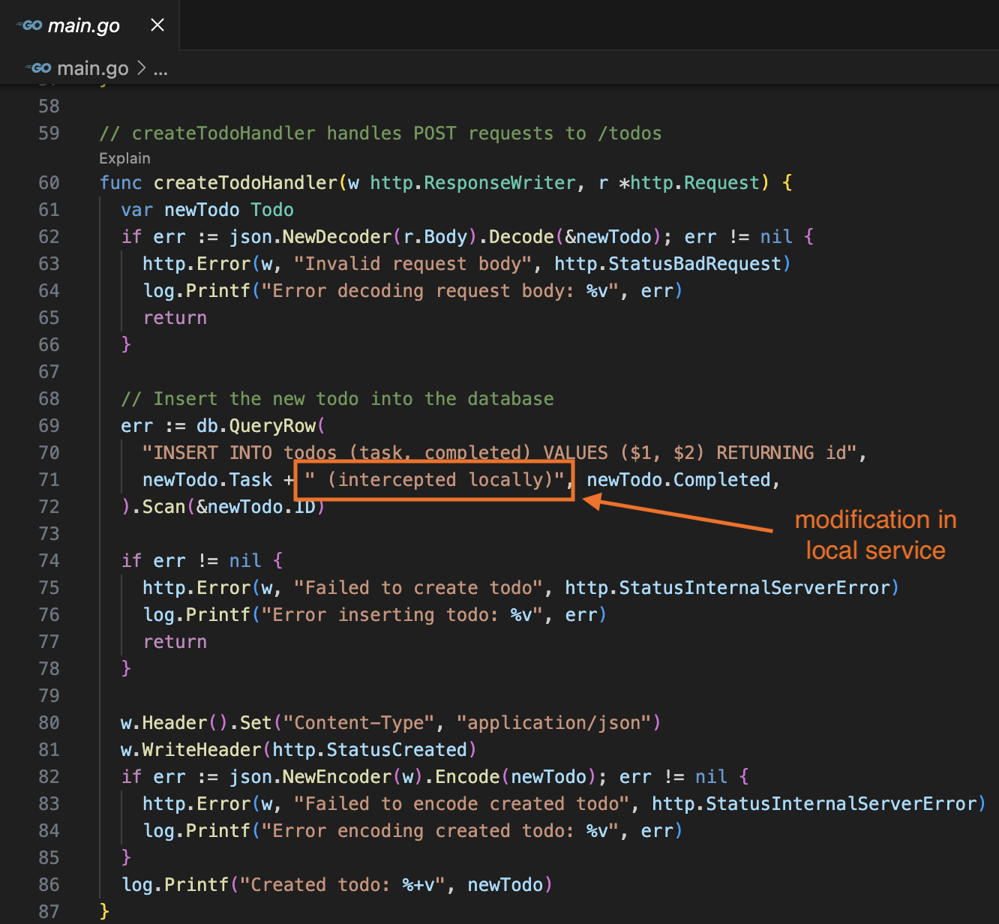
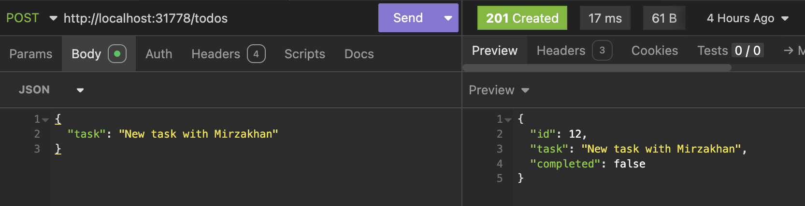
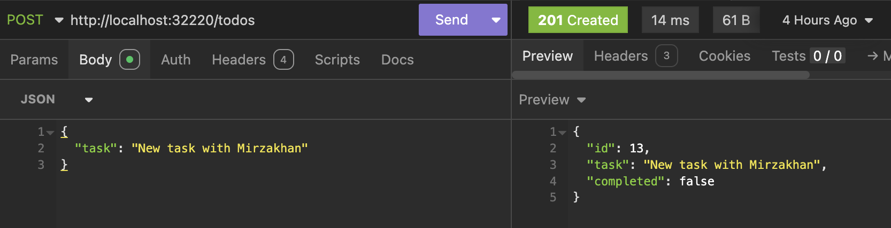
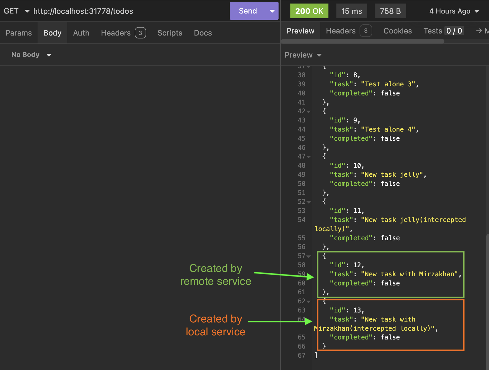
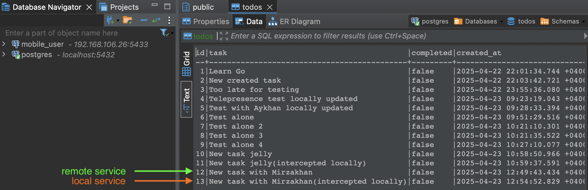

# Telepresence tool demo on K8S - Todo API

A simple RESTful API for managing todo items built with [Go](https://go.dev/) and [PostgreSQL](https://www.postgresql.org/), deployable to [Kubernetes](https://kubernetes.io/).

Using [Telepresence](https://telepresence.io/) you can replace or intercept pods (based on port routing) in Kubernetes or OpenShift cluster with local running application.

By applying this technology developer can decrease the feedback loop during service development by eliminating CI/CD deployment waiting time (dev/staging environments) and enabling debugging possibility with breaking points in their local machine.

## Architecture



[Source](https://telepresence.io/docs/reference/architecture)

## Features

- RESTful endpoints for managing todos
- PostgreSQL database backend
- Kubernetes deployment ready
- Multiple ports (8080, 8081, 8082) for different concerns
- Secure credential management

## Prerequisites

- Go 1.24+
- Docker
- Kubernetes cluster (local or remote)
- PostgreSQL database
- Telepresence (optional, for local development)

## Local Development Setup

1. Clone this repository
2. Create your environment file from the template:
```bash
cp todo-api-intercept.env.template todo-api-intercept.env
```

3. Edit the environment file with your database credentials:
```bash
# Edit the required values
POSTGRES_HOST=your_database_host
POSTGRES_PORT=5432
POSTGRES_USER=your_username
POSTGRES_PASSWORD=your_secure_password
POSTGRES_DBNAME=todos
```

4. Run the application locally:
```bash
go run main.go
```

## Docker Image Build

Build a Docker image for deployment:

```bash
docker build -t todo-api:latest .
```

For publishing to Docker Hub:

```bash
# Tag the image
docker tag todo-api:latest yourusername/todo-api:latest

# Push to Docker Hub
docker push yourusername/todo-api:latest
```

## Kubernetes Deployment

### Prepare Secrets

Create Kubernetes secrets before deployment:

```bash
kubectl create secret generic postgres-credentials \
  --from-literal=POSTGRES_HOST=your_host \
  --from-literal=POSTGRES_PORT=5432 \
  --from-literal=POSTGRES_USER=your_user \
  --from-literal=POSTGRES_PASSWORD=your_secure_password \
  --from-literal=POSTGRES_DBNAME=your_dbname
```

### Deploy Application

Deploy using the template:

1. Create a deployment file from the template:
```bash
cp deployment.yaml.template deployment.yaml
```

2. Apply to your cluster:
```bash
kubectl apply -f deployment.yaml
```

### Verify Deployment

Check deployment status:

```bash
kubectl get pods -l app=todo-api
kubectl get service todo-api-service
```

Example: Running containers



## API Endpoints

- `GET /todos` - List all todo items
- `POST /todos` - Create a new todo item

Example POST request:
```json
{
  "task": "Learn Kubernetes"
}
```

## Using Telepresence for Local Development

1. Connect to your cluster with `telepresence connect`.

2. Replace a running Kubernetes pod with your local development environment (only requests to 82 port will be routed to local instance):
```bash
telepresence intercept todo-api --port 8082:82 --env-file ./todo-api-intercept.env --replace
```
More information at [official docs](https://telepresence.io/docs/howtos/engage#intercept-your-application).

3. Modify local service for testing


4. Run local service (will be communicate with kubernetes for interception)
```bash
go run main.go
    2025/04/23 10:57:52 Successfully connected to PostgreSQL
    2025/04/23 10:57:52 Server starting on port :8082
    2025/04/23 10:57:52 Server starting on port :8081
    2025/04/23 10:57:52 Server starting on port :8080
    2025/04/23 12:54:52 Created todo: {ID:13 Task:New task with Mirzakhan Completed:false}
    ^Csignal: interrupt
```

5. See externally exposed service ports
```bash
kubectl get service todo-api-service
```
Output:
```log
NAME               TYPE       CLUSTER-IP      EXTERNAL-IP   PORT(S)                                  AGE
todo-api-service   NodePort   10.104.222.69   <none>        80:31778/TCP,81:32051/TCP,82:32220/TCP   5h43m
```
Port 31778 will be used for remote pod, however requests going to port 32220 will be routed (intercepted) to local instance

6. Send request to remote instance for todo creation


7. Send the same request to local instance


8. Fetch todo entries from either local or remote service


9. Check in Postgres DB


10. Stop interception
```bash
telepresence leave todo-api
```

## Service Ports

The application exposes multiple ports for different purposes:

- Port 8080: Main API endpoints
- Port 8081: Metrics (not used for real purpose in this project)
- Port 8082: Debug endpoints (will be intercepted by local instance using Telepresence)

## License

MIT